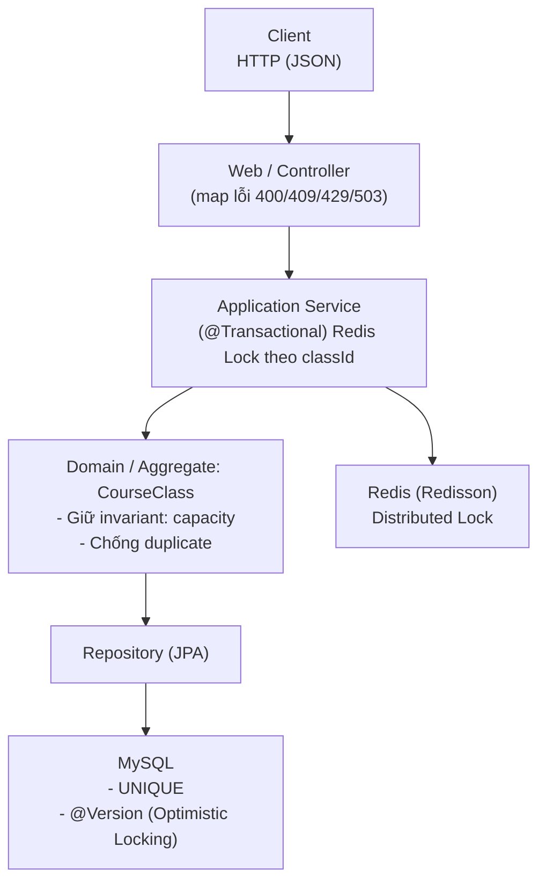

# University Course Registration System

> **Personal Project – July 2025 – Present**  
> Modular Monolith theo **DDD**. Bảo đảm **an toàn đồng thời** khi đăng ký lớp bằng **Redis distributed lock (Redisson watchdog)** + **Optimistic Locking**. REST API gọn nhẹ, có test đồng thời & script đo hiệu năng.

---

## Tính năng chính

- Đăng ký / hủy đăng ký lớp học theo **bounded context** `student`, `course`, `enrollment`.
- **Chống oversell**:  
  - Redis **distributed lock** theo `classId` (Redisson watchdog – không đặt `leaseTime` cố định).  
  - **Optimistic Locking** với `@Version` trên `CourseClass`.  
  - **UNIQUE (course_class_id, student_id)** ở DB để chống trùng tuyệt đối.
- **API** REST: validation cơ bản, map mã lỗi phù hợp (400/409/429/503).
- **Test đồng thời (JUnit)** + **k6** để kiểm tra tải và p95/p99.
- Kiến trúc **modular monolith** theo **DDD layers**: `web → application → domain → infrastructure`.

---

##  Kiến trúc & luồng xử lý

## 🛠 Công nghệ

- **Java 21**, **Spring Boot 3**, Spring Data **JPA**
- **MySQL 8**, **Redis 7** (Redisson Spring Boot Starter)
- **Maven**
- Test: **JUnit 5**, **Testcontainers** (khuyến nghị), **k6** (load test)

---
